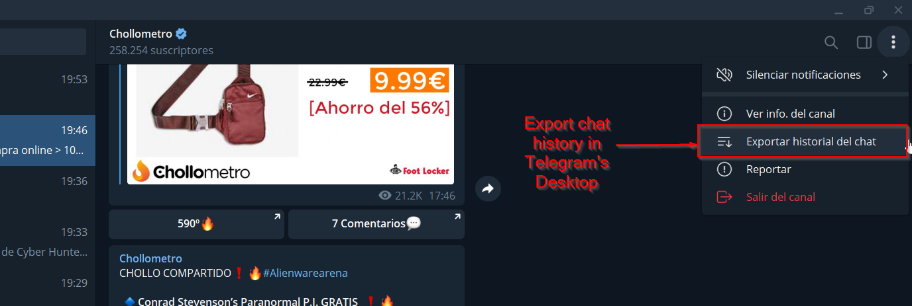
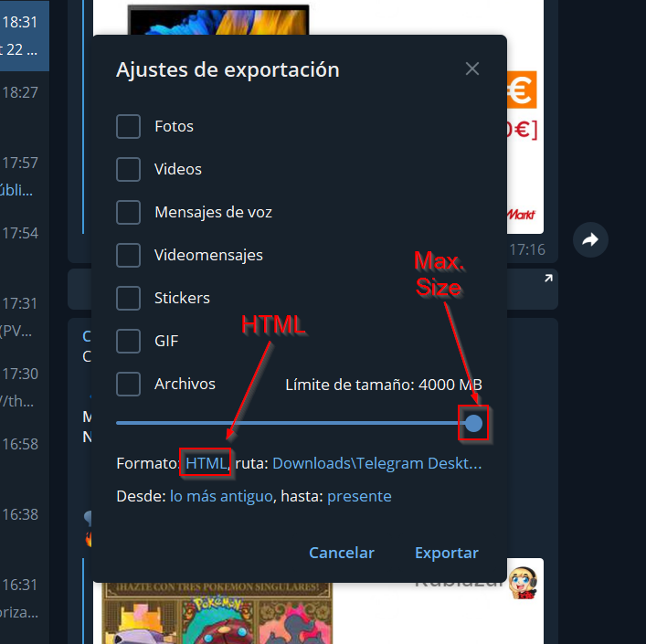
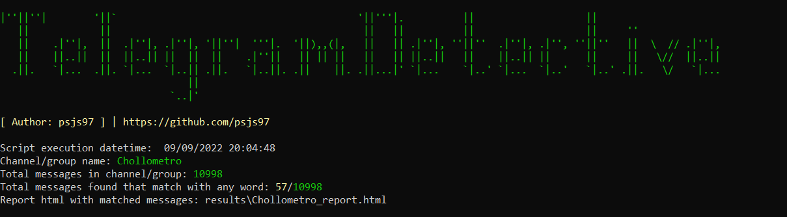

# Telegram Detective
Get messages from specific Telegram's channel or group according to customizable wordlist.

# Usage
python telegramDetective.py [-h] -d DIRECTORY -w WORDLIST

# Previous steps
## Export Data form Group / Channel
First, you need to export data from specific Telegram's channel or group using Telegram Desktop:

Select HTML format and max. size:

# Example
 