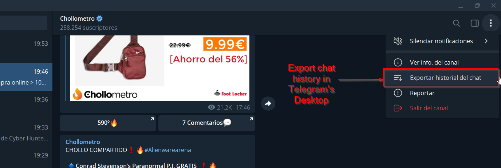

# Telegram Detective
Get messages from specific Telegram's channel or group according to customizable wordlist.

# Usage - Steps

## Export Data form Group / Channel
First, you need to export data from specific Telegram's channel or group.

Select HTML format and max. size.

python telegramDetective.py [-h]

# Example
 